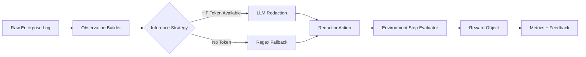
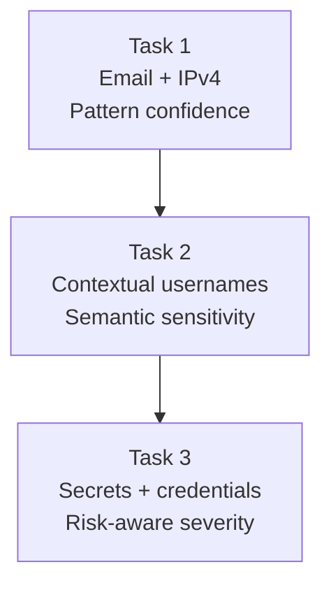
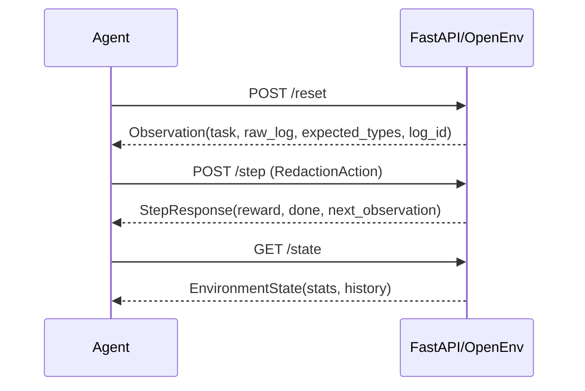
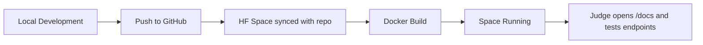

# Sentinel-Log-Shield

**Enterprise-grade OpenEnv environment for intelligent log sanitization and risk-aware PII redaction.**

[](#)
[](#)
[](#)
[](./LICENSE)

## Why This Project Stands Out

- Detects sensitive values across a progressive 3-task benchmark.
- Preserves operational usefulness of logs while removing high-risk tokens.
- Supports both LLM reasoning mode and stable regex fallback mode.
- Returns explainable reward metrics (precision/recall/F1/over-redaction).
- Deploys cleanly to Hugging Face Spaces using Docker.

## Live Endpoints

- GitHub: `https://github.com/bhaveshdamani5-crypto/senitel-env`
- Hugging Face Space: `https://huggingface.co/spaces/bhavesh657/senitel-env2`
- API docs (once deployed): `/docs`
- Technical docs: `/redoc`

## Architecture Overview



## Task Progression Design



## Episode Lifecycle



## Repository Structure

```text
senitel-env/
├── env.py               # Core environment logic (reset/step/state)
├── models.py            # Pydantic contracts for observation/action/reward
├── inference.py         # LLM + regex inference runner
├── server.py            # FastAPI app + premium docs UI
├── grader.py            # Reward and validation logic
├── demo.py              # Demo and local validation runner
├── openenv.yaml         # OpenEnv metadata/spec
├── Dockerfile           # Space container image
└── README.md
```

## Quick Start

```bash
git clone https://github.com/bhaveshdamani5-crypto/senitel-env.git
cd senitel-env
pip install -r requirements.txt
python inference.py
```

### Optional: Enable LLM Mode

```bash
export HF_TOKEN="hf_..."
export API_BASE_URL="https://api-inference.huggingface.co/openai/"
export MODEL_NAME="meta-llama/Llama-2-70b-chat-hf"
python inference.py
```

## API Usage

```bash
uvicorn server:app --host 0.0.0.0 --port 7860 --reload
```

```bash
curl -X POST http://localhost:7860/reset
curl http://localhost:7860/health
curl http://localhost:7860/state
```

## OpenEnv Validation Proof

Run the official validator from the project root:

```bash
python -m openenv.cli validate
```

Expected successful output:

```text
[OK] senitel-env-deploy: Ready for multi-mode deployment
```

## Baseline Inference Smoke Run

Run baseline inference (uses `HF_TOKEN` when present, regex fallback otherwise):

```bash
python inference.py
```

Latest local smoke-run summary:

```text
[START] task=task_2 ... [END] success=true score=1.00
[START] task=task_1 ... [END] success=true score=1.00
[START] task=task_3 ... [END] success=false score=-0.10
```

## Deployment Flow (GitHub -> HF Spaces)



## Quality and Reliability

- Typed data contracts via Pydantic.
- Deterministic fallback behavior when external API is unavailable.
- Clear endpoint boundaries and structured error handling.
- Built-in health check for deployment confidence.

## Troubleshooting

- `ModuleNotFoundError`: run `pip install -r requirements.txt`.
- HF token warning: set `HF_TOKEN`, or run regex fallback mode.
- Space build issues: verify HF secrets and restart the Space.
- Endpoint issues: check `/health` first, then `/docs`.

## License

MIT License. See `LICENSE`.

---

Built for high-trust security log processing and OpenEnv evaluation.
